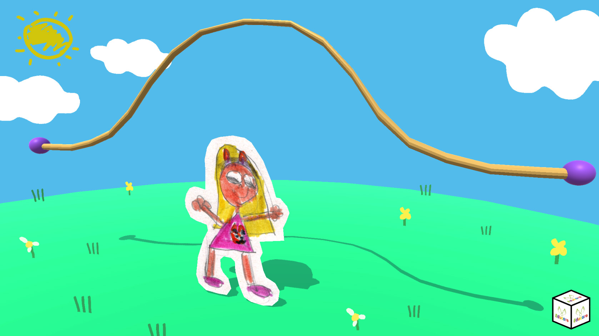
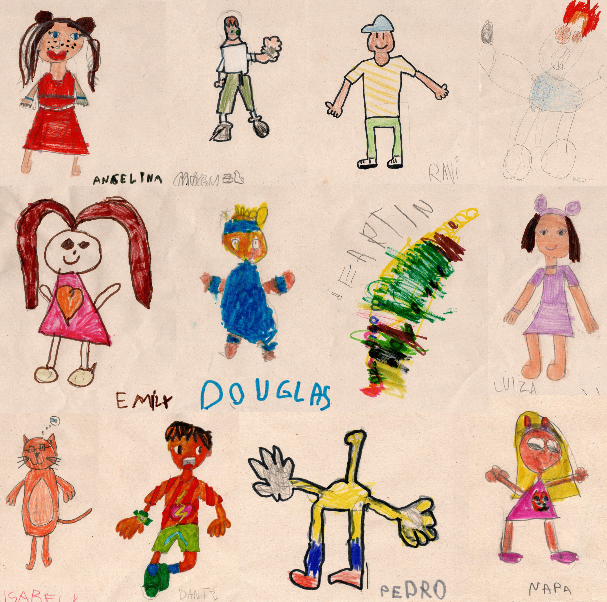
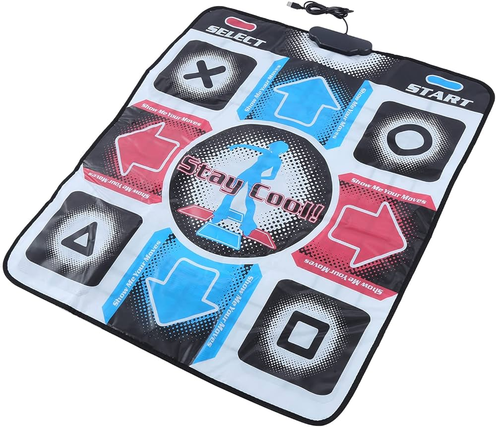

# Pula Corda - Jogo

Jogo feito em Unity e tapete de dança para crianças do primeiro ano da Escola Educare - São Roque

### Motivação
O tema da escola deste semestre é sobre brinquedos e tivemos uma reunião com a coordenação pedagógica da escola para uma parceria na criação de um jogo que trouxesse uma perspectiva de debate da relação das crianças com os video-games e, quiçá, com jogos de uma maneira geral. Algo surgiu sobre relacionarmos analógico e digital, pensando numa abertura para uma crítica acerca da nulidade da maioria da produção de entretenimento. Fato é que grande parte das crianças já demonstram interesse por video-games, e este é um assunto que deve ser tratado de maneira acadêmica, por andarem na esteira da má informação, do cunho ideológico ou dos excessos, marketing e mercado dos tempos em que vivemos.

Com isto, chegamos na ideia de criarmos um jogo de pular corda digital (já que esta foi uma das brincadeiras mais importantes do semestre) de maneira que os alunos pudessem participar na construção. Não de maneira a se programar (levamos em conta a importância do pensamento computacional e não a codificação), então algo de participação como criando avatares e claro, participando de jogadas coletivas.

O mapeamento do impacto educativo, ou de discussão deste tipo de jogo ainda será aqui registrado, precisando ser também analisada uma metodologia de apoio para tal empreitada. Porém, o que já foi previamente aqui pensando: abrir um entendimento para que as crianças possam pensar em construir seus jogos, futuramente; entender o impacto de uma produção híbrida, qual sentido cognitivo ou a longo prazo deste tipo de interação, de consumidores para investigadores.

Desenhos dos avatares feitos pelos alunos do primeiro ano.

### Desenvolvimento
O jogo foi criado em Unity e possui interface simples, com o game loop rodando sem precisar de outra funcionalidade além de utilizar o mesmo botão. Durante o desenvolvimento, alguns acertos foram necessários, apesar da ideia e implementação relativamente simples. A checagem dos colisores, a corda 3D, a funcionalidade de soltar o botão, balanço da dificuldade, entre outras, foram possíveis através do teste com uma criança de 7 anos (Nara).

O jogo possui a proposta de fazer um teste de usabilidade com hardwares alternativos, saindo do circuito óbvio de joysticks e valorizando a locomoção. Nos testes de gameplay, foi interessante notar que a funcionalidade do botão precisava ser alterada para pular quando o mesmo fosse solto, e não apertado, simulando o pulo. Isto pode abrir um experimento para testes de conflito de informação (e diversão) entre o que seria correto e uma possibilidade criada pelo digital. Assim a discrepância entre pular corda real e um correlato propositalmente distorcido virtual pode ser um campo amplo de investigação.

### Como jogar

- Espaço: pula;
- Tecla "x": altera para modo aleatório de avatar.
-  Setas, esquerda e direta: mudam avatar.

Obs: É recomendado um tapete de dança ou interface similar para utilizar os pés.

### Recursos

- Sistema automático de importação de imagens (avatares) para o personagem do jogo;
- Ativar/desativar sistema de avatares aleatórios; A cada jogada, um novo avatar é atualizado no personagem;
- Seleção manual dos avatares (esquerda e direita);
-  Game loop simples contendo: contador de início, sistema de pulo e checagem de indicativo de tropeço na corda;
-  Restart com mesmo botão, o qual fará uma escolha nova de avatar e nova partida;

### Observações

- O jogo foi feito em três dias. Uma tarde para protótipo geral, e outro dia para para polimentos e ajustes;
- Utilizei o chatGPT para criar funções. Resultado bem satisfatório;
- O gameplay pareceu funcionar bem, com engajamento. Porém, após múltiplas jogadas e insistência em jogar, a criança pareceu irritada (mas nada estatístico). Isto pode ser eventualmente balanceado ao ser jogado em turma, sem excesso de maestria de habilidade;
- Optei por retirar o contador de pulos, favorecendo a contagem por voz da turma;
- O recurso de sorteio aleatório dos avatares, pode ser ativado e desativado. Pretendo com isso, falar sobre aleatoriedade com as crianças, levando um D4, D6 e um D20 em sala;
- O mesmo com o placar: inicialmente tinha pensando em utilizar uma pontuação para cada avatar, favorecendo a competição. Mas o jogo pareceu funcionar como está e assim ficará mais leve;
- A dificuldade já está balanceada. Nara conseguiu, com muito esforço, em torno de 10 pulos. Pode-se adicionar mais dificuldade como aumento da velocidade da corda ou apertar outros botões do tapete durante os pulos da corda, mas não parece ser necessário no momento;
- Utilizei o Antimicrox para mapear os botões do tapete;

### Atualizações da versão 1.0

- Mudança para URP;
- Polimentos como: sol animado, nuvens, grama e cores seguindo paleta da Peppa Pig;
- Adição de dado para ensinar aleatoriedade (botão x) e seleção de avatar do tipo carrossel (setas esquerda e direita);
- Adição de som de pulo e som de tropeço;
- Adição de 20 Avatares (8 do 1º Ano A e 12 do 1º Ano B)
